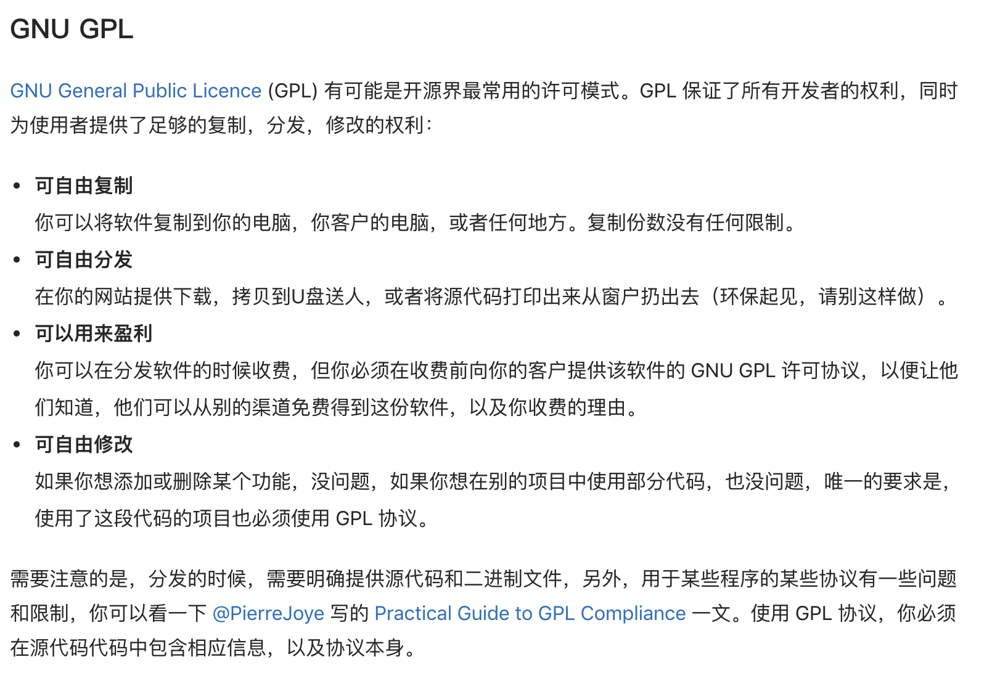

## hin2n版权声明

hin2n是本人及zhangbz等开发者基于开源内网穿透软件[n2n](https://github.com/ntop/n2n)开发的针对安卓手机的内网穿透软件。该项目以[GPLv3](https://github.com/switch-iot/hin2n/blob/dev_android/LICENSE)协议开源，与n2n原有开源协议保持一致，也希望大家支持并遵守本项目的开源协议。

- `GPL协议介绍`:

近期了解到国内一些开发商在hin2n的基础上做了一些修改，甚至通过反编译的手段修改hin2n的功能，并且未对修改版开源，该种行为严重违反了GPLv3协议，并且一些开发商的收费行为也未遵守GPLv3协议。我们强烈谴责此种不尊重软件开发者，不尊重用户，违反开源协议与开源精神的行为，并将保留追究其法律责任的权利。

最后，希望广大用户使用更稳定的开源版本[hin2n APP](https://github.com/switch-iot/hin2n)。

2020-04-21 by switch.st@gmail.com
